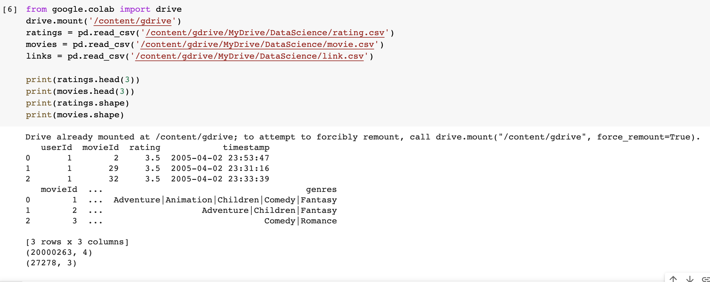

# Data Science Movie Recommendation

## Introduction
The objective of this project was to create a recommendation system based upon ratings from previous users on well known movies.
I have been curious about movies my whole life and love doing projects on them. Last semester I worked on a movie database for Databases to query information from the dataset. In this course for Data Science I wanted to you machine learning to see movie recommendations. I used google colab, github, streamlit and a kaggle dataset to recommend movies.

This project is inspired by the [the 20m movielens dataset](https://www.kaggle.com/grouplens/movielens-20m-dataset) [1].  

I wanted to ease the web app development and [Streamlit](https://www.streamlit.io/) made this possible [2]. It is an open-source library that focuses on data science and ML web app development. 

## Selection of Data

The model processing and training are conducted using a Jupyter Notebook and is available [here](https://github.com/nguyenj32/dsMovie/blob/main/MovieReccomendation.ipynb).

The data for ratings.csv has 20,000,263 samples with 4 features: userId, movieId, rating, timestamp. Another dataset used in conjuction is movie.csv which has 27,278 samples with 3 features: movieId, title, and genre. However, I droped the data to clean it by removing entries that had less than 500 rating counts. I also removed the genre, timestamp and number of ratings to reduce the dataset. 

The objective is to recommend movies based upon a given movie.

Data preview: 

## Methods

Tools:
- NumPy, SciPy, Pandas, and Scikit-learn for data analysis and inference
- Streamlit (st) for web app design
- GitHub for version control
- Sublime as text editor

Inference methods used with Scikit:
- Nearest neighbor model

## Results
The app is not delployed yet, but it works on local machines. I will deploy it soon.

## Discussion

## Summary

## References
[1] [20m Movielens Dataset](https://www.kaggle.com/grouplens/movielens-20m-dataset)

[2] [Streamlit](https://www.streamlit.io/)

[3] [Google Collab](lab.research.google.com/drive/1aDNapHbcVyGnXLpuQ6qyfXgQa9nd2r4x#scrollTo=JIVismfIUkX1)
